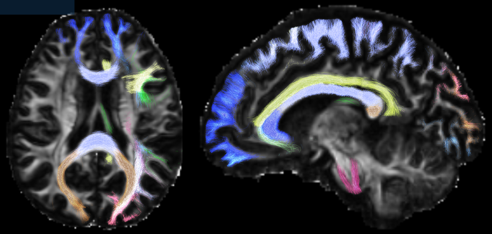

# auto_tracto

Perform automatic virtual dissection of a full-brain tractogram.

Provide a pre-computed tck file and it will be dissected.
This is an adaptation of AutoPtx and XTRACT to work with MRtrix3. See these links:

* https://fsl.fmrib.ox.ac.uk/fsl/fslwiki/AutoPtx
* https://fsl.fmrib.ox.ac.uk/fsl/fslwiki/XTRACT

## Important considerations:
- The adaptation is only partial, as in AutoPtx and XTRACT the seeding of Streamlines   is performed for each bundle. Here, a full tractogram is provided, where the user   had the option to seed with whatever strategy was preferred. It is assumed, however,   that a full-brain seeding approach was used (white matter mask, GM/WM border, etc.)
- Another difference is the use of STOP ROIs, which only make sense if seeding   is performed per bundle, and not if filtering a full tractogram.   STOP ROIs are used, nonetheless, but rather as termination criteria that will truncate   the streamlines. Thus, STOP ROIs should be much larger than usual, to avoid   the appearance of multiple short-length truncated streamlines.
- The quality of the full brain tractogram will determine the quality of bundle separation.   It is highly recommended to provide a tractogram with more than one million streamlines,   and one that has been checked for errors. Strategies such as anatomically-contstrained   tractography (ACT) and spherical deconvolution informed filtering of tractograms (SIFT),   both available in MRTrix3 should aid in obtaining such high-quality tractograms.

## Requirements:
* [MRtrix version](https://www.mrtrix.org/) 3.0 (tested with version 3.0_RC3-83-g538f905c)
* [fsl](https://fsl.fmrib.ox.ac.uk/fsl/fslwiki/FSL) version > 5.0 (tested with version 5.0.6)
* [Python 3](https://www.python.org/) tested with version 3.7.4 and [Dipy](https://dipy.org/) (tested with version 1.0.0)
* [Matlab] tested with version 2018a

The main script is [auto_tracto_fnirt.sh](auto_tracto_fnirt.sh). You will need the dissection protocols. Here you can find an adapted version of the protocols found in XTRACT and autoPtx, in the folder called [Lanirem](Lanirem) (Lanirem is the acronym of the [National Laboratory for magnetic resonance imaging](http://www.lanirem.inb.unam.mx/), a joint effort between [UNAM](https://unam.mx/), [CIMAT](https://cimat.mx/) and [Conacyt](https://www.conacyt.gob.mx/)). Please see see the file [tract_definitions.md](tract_definitions.md) for descriptions of the tracts dissected and the Dice coefficients between the Lanirem protocol and XTRACT and autoPtx protocols.

---

This repository also contains other files that have been of use for batch processing of data related to the collaborative project *Defining white matter: towards standardizing nomenclature, ontology, and taxonomy of white matter pathways, and practices to dissect them with diffusion MRI fiber tractography*, lead by Kurt Schilling and Maxime Descoteaux. In particular, the files [tracto_repro_do_autotracto.sh](tracto_repro_do_autotracto.sh) performed the auto_tracto for all subjects, and the additional steps for the final results are done with [truncate_unsupported_streamline_ends.sh](truncate_unsupported_streamline_ends.sh), and [intersect_tck_streamlines.sh](intersect_tck_streamlines.sh). A few utilities are included, such as [dice.sh](dice.sh) and [echolor](echolor).
